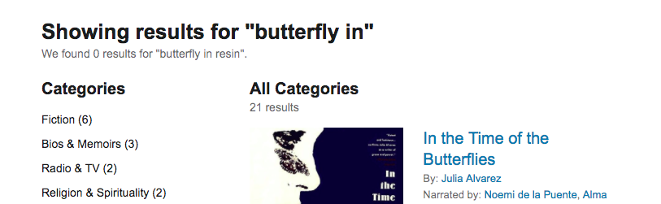

# "Or something like that": a fuzzy search application for short texts

More often when what we search for something by keywords, what we actually mean is **"show me the butterfly book, or something like that"**. Most current search application base on word matching cannot handle the case well if we type in the wrong keywords. In order to solve this "or something like that" problem. I plan to build a "fuzzy search" app that can return results base on similarity in the meaning of keywords. This is possible using the  pre-trained word to vector model and some other natural language processing (NLP) skills.

The current prototype can return **"Dragonfly in amber"** when we search for **"Butterfly in resin"**, and return **"A Knight of the Seven Kingdoms"** when we search for **"Six empire"**. 

I also show here clustering of book titles based on meaning and a potential case of "book suggestion".

## Motivation

When we "search" for something from a database, we type a few words that we think are the "keywords". 

Say we are looking for a book called **"Dragonfly in amber"**, usually it is as simple as that:

### "Find the butterfly book, or something like that!"

However, more often when what we type in keywords, what we actually mean is **"show me this butterfly book, or something like that"**. In this case, most of current web application may not give you the book that you actually want.

Say, if somehow in your mind, you thought the book is called **"Butterfly in resin"**:

In this case you will not get the dragonfly book you want.

## Proposal

In order to solve this "or something like that" problem. I plan to build a "fuzzy search" app that can return results base on the meaning of keywords, in addition to exact match of words.This is possible using the **word to vector** model pre-trained with google news, and some other natural language processing (NLP) skills (e.g. dealing with stopwords).

I plan to used web scraping to get the database (e.g. book listing on audible.com), and create user interface using Django framework. The goal is to optimize the application, so the search result will be as similar to what the user might have in mind. 

## Preliminary results

Base a preliminary database of ~300 book listing (bestsellers in three category) on audible.com, I created python function that can return titles similar to a search string (what user think is the title). 

I presented two cases below where there is no match between the words in the search string and the book title. The current prototype can return **"Dragonfly in amber"** when we search for **"Butterfly in resin"**, and return **"A Knight of the Seven Kingdoms"** when we search for **"Six empire"**.

I also show here clustering of book titles based on meaning and a potential case of "book suggestion". I visualized the similarity of some books based on the meaning of titles (and an anecdotal result that there is no simple way to distinguish books of "Erotica", "Military", or "Sci-Fi" base only on the titles).

## code
** Fuzzy_search.ipynb: demo of the fuzzy search
** Books: exploratory data analysis
